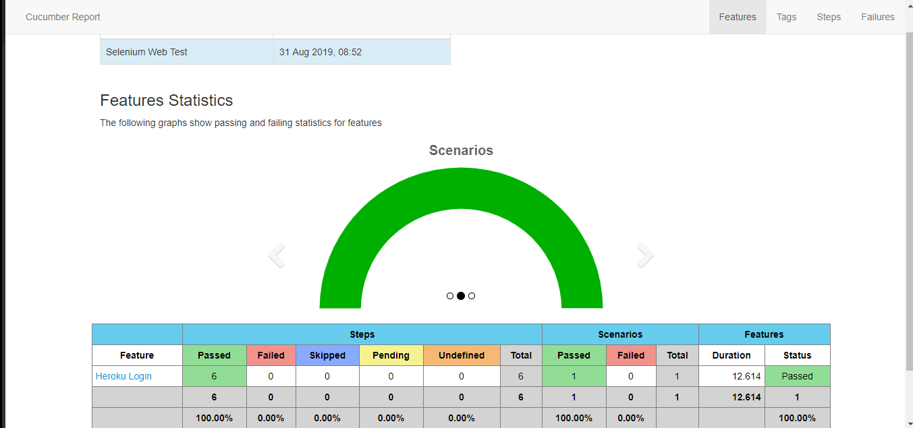

# Selenium web test

## Prerequisites
- Install Java JDK 1.8

- Install IntelliJ IDEA

- Download chromedriver.exe file from: https://chromedriver.chromium.org/

## Dependencies Configuration
1/ Open the project in the installed Intellij IDE

2/ Update the pom.xml file with all cucumber and selenium dependencies

3/ Add IntelliJ cucumber plugin:
+ select File/Settings/Plugins
+ search for Cucumber for Java plugin
+ click "Install"

4/ add JUnit and Hamcrest libraries:
+ select File/Project Structure/Modules
+ click on add button (+)
+ look for junit4.12.jar and hamcrest-core-x.x.jar file in java lib folder
+ add them to your project

5/ Modify the PATH in "src/main/java/com.sample/Configs.java", this is the location of "chromedriver.exe".
Ex: C://Users/username/chromedriver.exe

## Run the tests
Right click on "./test/java/runner/TestRunner.java" and select "Run".

## Html Report
When the test is done. The Html report can be found in "./target/cucumber/cucumber-html-report" folder

